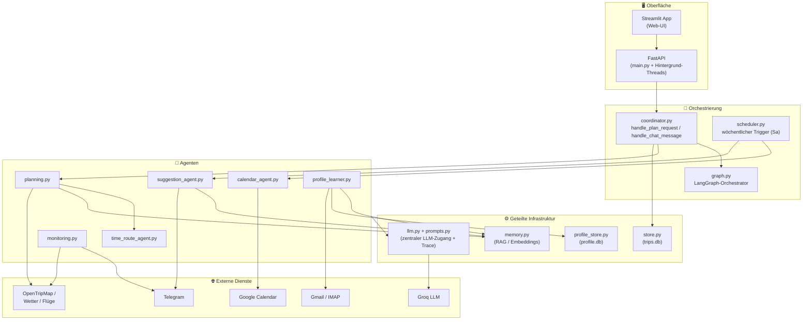
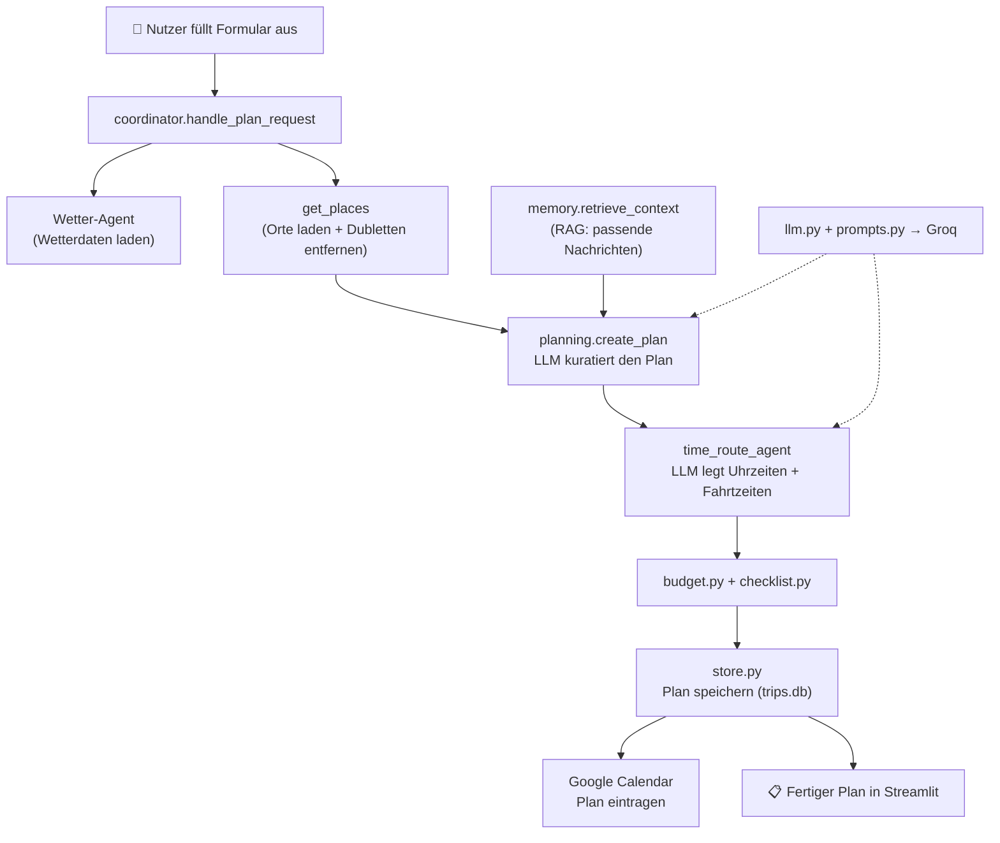
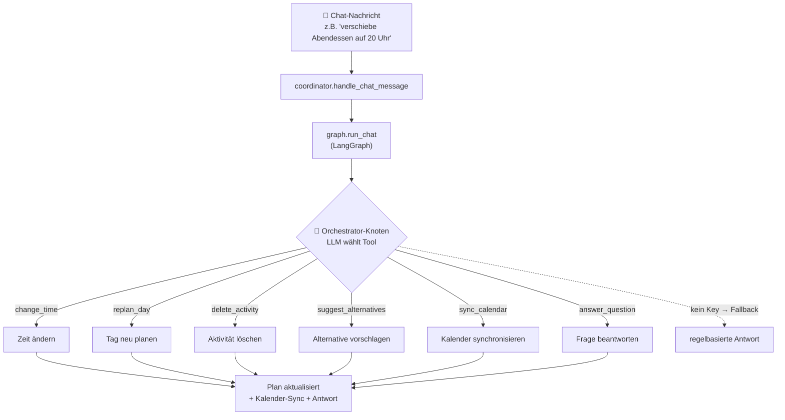
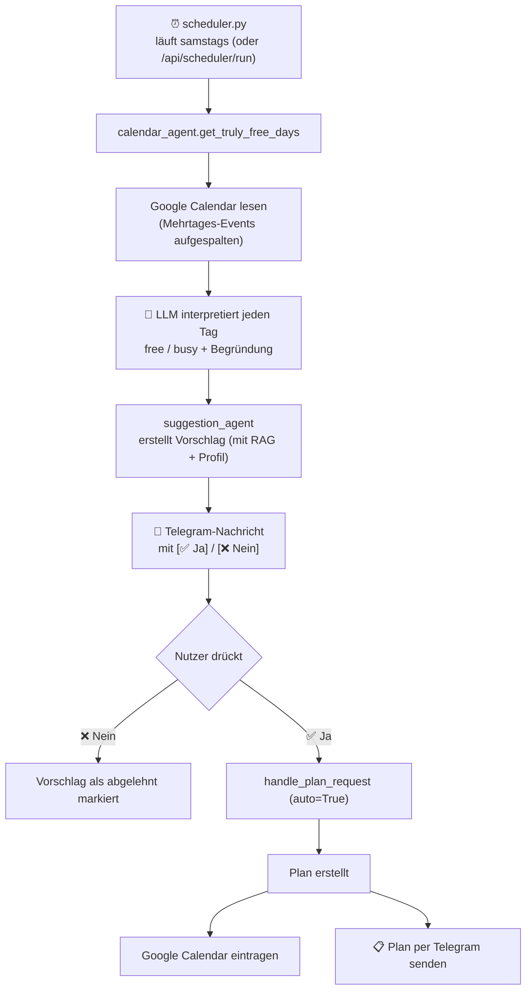
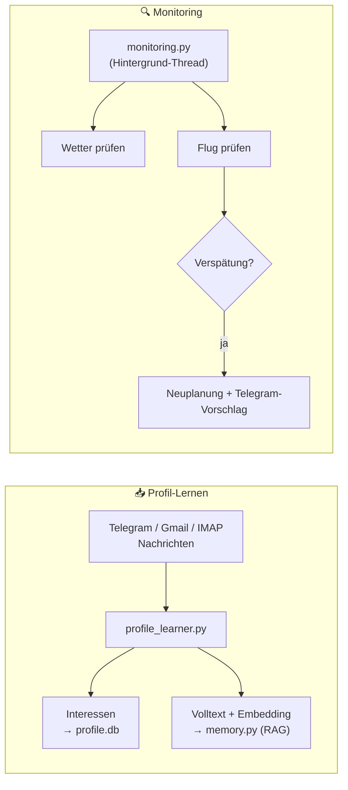

# Workflow-Übersicht — Reiseplanungs-Agent (Stand 28.06.2026)

> Diese Diagramme sind in **Mermaid** geschrieben. Zum Anzeigen einfach den Code-Block kopieren
> und auf **https://mermaid.live/** einfügen — oder direkt in GitHub/VS-Code rendern lassen.

---

## 1. Gesamtarchitektur (Schichten)

Wie die Bausteine zusammenhängen — von der Oberfläche über die Orchestrierung und die Agenten
bis zur geteilten Infrastruktur und den externen Diensten.

---

## 2. Ablauf A — Manuelle Reiseplanung (Nutzer stößt an)

Der klassische Weg: Der Nutzer füllt das Formular aus, das System orchestriert die Agenten
und liefert einen fertigen Tagesplan zurück.

---

## 3. Ablauf B — Chat-Befehl (LangGraph-Orchestrator)

Statt Regex entscheidet jetzt ein LLM per Tool-Calling, welcher Handler eine Chat-Nachricht
ausführt.

---

## 4. Ablauf C — Proaktiver Scheduler + Telegram (das neue Herzstück)

Einmal pro Woche denkt das System selbst voraus, erkennt freie Tage und schlägt per Telegram
eine Reise vor. Der Nutzer entscheidet per Knopfdruck.

---

## 5. Hintergrund — Profil-Lernen & Monitoring (läuft dauerhaft)

Zwei Hintergrund-Stränge, die das System „intelligent" und „aufmerksam" machen.

---

## Kernbotschaft für die Präsentation

- **Ein zentraler LLM-Zugang** (`llm.py`) speist alle KI-Funktionen — mit Live-Trace zum Mitverfolgen.
- **Drei Eintrittspunkte:** manuelle Planung, Chat (LangGraph), proaktiver Scheduler.
- **Gedächtnis (RAG):** das System merkt sich Nachrichten und personalisiert damit Pläne.
- **Human-in-the-Loop:** proaktive Vorschläge kommen automatisch, aber der Mensch entscheidet per Knopf.
- **Robust by design:** ohne API-Key oder bei Fehlern fällt alles sauber auf die alten, regelbasierten Wege zurück.
