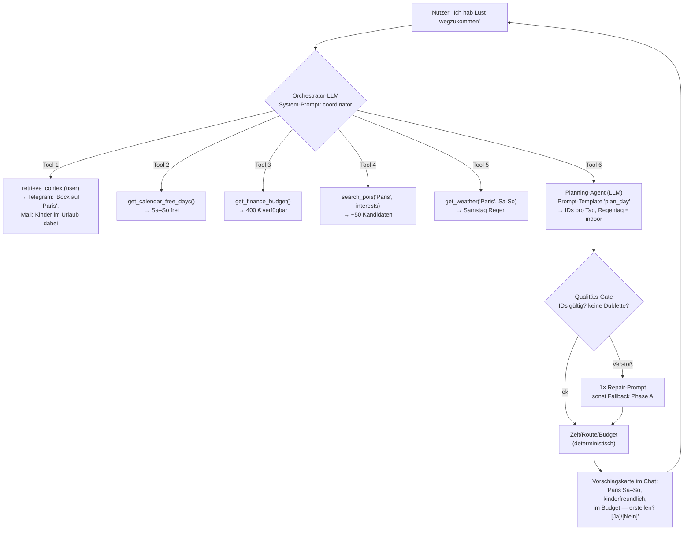

# Umbau-Vorschlag — vom regelbasierten zum agentengetriebenen Reise-System

> Erstellt nach Tiefenanalyse des **gesamten Codes** (Stand 2026-06-27) und auf Basis der Review-Session
> mit dem Professor. **Dieses Dokument enthält nur Analyse + Vorschlag — kein Code.**
> Abgeglichen mit den aktuellen Design-Dokumenten dieser Session: ARCHITEKTUR_PLANUNG_LLM.md,
> IMPLEMENTIERUNGSPLAN_PHASE_B.md, ZUKUNFT_NOTIZEN.md. (Die früheren Dokumente ZIELARCHITEKTUR.md /
> SYSTEM_ARCHITECTURE.md sind als „Old Documentation – do not use" deprecatet und werden bewusst nicht herangezogen.)

---

## 1. Ist-Analyse (kompakt)

### 1.1 Zwei Einstiegspunkte, inkonsistent verdrahtet
- **Streamlit** ([streamlit_app.py](reiseagent/streamlit_app.py)) ruft den Coordinator **direkt per Import**
  über [ui_service.py](reiseagent/ui_service.py) auf (`coordinator.handle_plan_request`,
  `coordinator.handle_chat_message`).
- **FastAPI** ([main.py](reiseagent/main.py)) bietet dieselbe Logik als HTTP-API + 3 Hintergrund-Threads
  (Monitoring, Navigations-Erinnerung, Telegram-Callbacks).
- Streamlit nutzt die API **nicht** — es gibt zwei parallele Pfade.

### 1.2 Die Orchestrierung ist ein fest verdrahteter Workflow
`coordinator.handle_plan_request()` ([coordinator.py:27](reiseagent/agents/coordinator.py)) ist eine
**lineare, hartcodierte Sequenz**:
```
Profil-Interessen mergen → Wetter → Places → planning.create_plan
   → (if flight_number) Flug anpassen → Budget → Checklist
```
Kein Agent entscheidet etwas. Es gibt keinen Router. Die Reihenfolge ist in Python festgeschrieben.

### 1.3 Der Chat ist ~1300 Zeilen Regex — nicht KI
`coordinator.handle_chat_message()` ([coordinator.py:262](reiseagent/agents/coordinator.py)) klassifiziert
Nutzereingaben über **hunderte Keyword-/Regex-Regeln** (`_is_clear_time_change_request`,
`_is_clear_replan_request`, `_category_from_text`, `_extract_requested_time` …) und ruft dann
deterministische Handler. Das LLM (`_groq_response`, [coordinator.py:1575](reiseagent/agents/coordinator.py))
ist nur ein **Fallback**, der frei antwortet, aber **den Plan nicht ändern kann**.
→ Genau der Punkt des Professors: „kein Unterschied zu ChatGPT", weil hier das LLM nur plaudert und die
Regeln die Arbeit machen.

### 1.4 LLM wird nur punktuell genutzt — ohne Tool-Calling, ohne zentrale Stelle
Vier Stellen rufen Groq (`llama-3.3-70b-versatile`) direkt und inline auf, jeweils mit Einzel-Prompt:
| Datei | Zweck | Tool-Calling? |
|---|---|---|
| [daily_brief.py:62](reiseagent/agents/daily_brief.py) | Morgenbrief-Text | nein |
| [navigation.py:28](reiseagent/agents/navigation.py) | Erinnerungstext | nein |
| [suggestion_agent.py:121](reiseagent/agents/suggestion_agent.py) | Vorschlag als JSON | nein |
| [coordinator.py:1587](reiseagent/agents/coordinator.py) | Chat-Q&A-Fallback | nein |

Kein zentrales `llm.py`, kein Tool-Calling, keine Prompt-Templates an einer Stelle.

### 1.5 Wo Qualitätsfehler entstehen (z.B. „Notre-Dame doppelt")
- **Dedup ist nur exakter Namensabgleich pro Aufruf:** `_rank_and_deduplicate`
  ([places.py:594](reiseagent/providers/places.py)) dedupliziert per *exakt normalisiertem Namen*.
  „Notre-Dame Cathedral" (CITY_HIGHLIGHTS) und „Cathédrale Notre-Dame" (OpenTripMap) gelten als
  **verschieden** → beide landen im Pool → Dublette möglich.
- **Keine globale Plan-Validierung:** `planning.create_plan` verhindert via `used_ids` nur **gleiche IDs**.
  Zwei verschiedene IDs für denselben realen Ort werden nicht erkannt.
- **Chat fügt ungeprüft hinzu:** `_custom_activity` ([coordinator.py:966](reiseagent/agents/coordinator.py))
  erzeugt neue UUIDs; die einzige Schranke ist ein exakter Namensvergleich (`_plan_contains_activity`).
- **Fazit:** Es fehlt eine **semantische, quellenübergreifende Dedup** + eine **finale Qualitätsprüfung**
  des fertigen Plans. Das ist die strukturelle Ursache des vom Professor gesehenen Fehlers.

### 1.6 Kontext-Integration (Telegram/Mail/Kalender) — heute oberflächlich
- **Telegram** ([telegram.py:99](reiseagent/providers/telegram.py)): `get_recent_messages` holt die letzten
  100 Updates, filtert nach Zeit; `find_trip_relevant_messages` filtert nach **hartcodierten Keywords**.
  **Keine Speicherung. Keine Vektordatenbank. Kein Retrieval.**
- **Gmail** ([gmail.py:54](reiseagent/providers/gmail.py)): gleiches Muster — Keyword-Filter, keine Speicherung.
- **Profil-Lernen** ([profile_learner.py](reiseagent/agents/profile_learner.py)): extrahiert Interessen per
  **Regex/Keyword** in `profile.db` (`interests`-Tabelle). Roh-Nachrichten werden **nicht** abgelegt.
- **Kalender** ([calendar.py:80](reiseagent/providers/calendar.py)): `find_free_days` betrachtet einen Tag nur
  dann als belegt, wenn er einen **REISEAGENT-Marker** trägt (`blocks_reiseagent_day`). **Echte fremde
  Kalendertermine blockieren keinen Tag** → die Freizeit-Erkennung ist praktisch wirkungslos für reale Termine.
- **Antwort auf die Frage des Professors** („Vektor-DB? ein Dokument pro Nachricht? wie gematcht?"):
  Heute = **nichts davon**. Es ist Keyword-Filter + Regex-Extraktion. Das ist eine klare Lücke (Abschnitt 4).

### 1.7 Proaktivität existiert, ist aber nicht verbunden
Die Bausteine sind da, aber nicht zu einem proaktiven Erlebnis verdrahtet:
- `free_time_detector` → `suggestion_agent` → `profile.db` → API `/api/suggestions/*` — **nur manuell per
  Endpoint** auslösbar, **kein Scheduler**, **nicht im Chat sichtbar**.
- `monitoring._monitoring_loop` ([main.py:50](reiseagent/main.py)) läuft im Hintergrund — aber **nur für
  Wetter + Flüge**, nicht für proaktive Reisevorschläge.

### 1.8 Flug-Logik ist rein regelbasiert
Flug-API wird nur getriggert, wenn `request["flight_number"]` gesetzt ist
([coordinator.py:75](reiseagent/agents/coordinator.py), [monitoring.py:226](reiseagent/agents/monitoring.py)).
Der Agent **entscheidet nicht selbst**, dass ein API-Call sinnvoll wäre.

### 1.9 Was deterministisch ist — und das auch bleiben soll
Zeiten/Taktung ([planning.py](reiseagent/agents/planning.py)), Fahrtzeiten
([providers/navigation.py](reiseagent/providers/navigation.py)), Budget ([budget.py](reiseagent/agents/budget.py)),
Kalender-Freitage-Mathematik. Diese rechnen korrekt und gehören **nicht** ins LLM (deckt sich mit der
Aussage des Professors: „LLMs rechnen schlecht").

### 1.10 Persistenz & bereits vorhandene Bausteine (Status quo)
- [store.py](reiseagent/store.py) ist **SQLite** (`trips`-Tabelle, ein JSON-Blob pro Trip) — bereits persistent.
- [profile_store.py](reiseagent/profile_store.py) ist SQLite (`interests`, `past_events`, `free_days`,
  `suggestions`).
- [providers/flights.py](reiseagent/providers/flights.py) und [monitoring.py](reiseagent/agents/monitoring.py)
  **existieren bereits** (Wetter-/Flug-Überwachung im Hintergrund-Thread).
- [models.py](reiseagent/models.py) enthält `TypedDict`s — werden aber **nicht zur Validierung** genutzt, nur
  als Typ-Hinweise. (Relevant für die Qualitäts-Gates in Abschnitt 3.)

---

## 2. Ziel-Architektur

### 2.1 Leitidee
Ein **LLM-Orchestrator** (Supervisor) nimmt die Nutzereingabe + einen verdichteten Kontext entgegen und
**entscheidet selbst per Tool-Calling**, welche Fähigkeiten (= Agenten/Provider als Tools) in welcher
Reihenfolge aufgerufen werden. Jeder Agent hat einen **eigenen System-Prompt**, **klare Tools** und ein
**Qualitäts-Gate** für seinen Output. Rechnen bleibt in deterministischen Tools.

### 2.2 Orchestrierungs-Ansatz: Empfehlung mit Begründung
Zwei Optionen, abgewogen gegen die Randbedingung „einfacher, anfängertauglicher Python-Code":

| Option | Pro | Contra |
|---|---|---|
| **A) LLM-Tool-Calling-Loop in Plain-Python** (empfohlen für den Start) | Sehr einfach: eine `while`-Schleife, die Groq mit Tool-Definitionen aufruft und Tool-Ergebnisse zurückgibt. Genau das „Agent entscheidet selbst". Kein neues Framework. | State-Handling muss man selbst sauber halten. |
| **B) LangGraph** | Expliziter State-Graph, gut für Tracing/Verzweigungen. | Zusätzliche Abhängigkeit + neue Konzepte; widerspricht „minimale Abstraktion" für ein Studi-Demo. |

**Empfehlung:** **Mit A starten** (echtes agentisches Verhalten bei minimaler Komplexität), **B optional
später**, falls die Verzweigungslogik wächst. Beide implementieren dasselbe Prinzip (Tool-Calling) — A ist
nur die schlankere erste Stufe. So bleibt der Code für das Team wartbar (entspricht dem Coding-Stil aus
IMPLEMENTIERUNGSPLAN_PHASE_B.md).

### 2.3 Routing-Mechanismus (Agent entscheidet, nicht fester Workflow)
```
Nutzereingabe ──► ORCHESTRATOR (LLM + Tools)
                    │  System-Prompt: "Du bist der Reise-Koordinator. Nutze die
                    │  Tools, um die Anfrage zu erfüllen. Entscheide selbst, welche
                    │  und in welcher Reihenfolge."
                    │
                    ├─ ruft Tool auf ──► retrieve_context(user_id, query)   [Memory/RAG]
                    ├─ ruft Tool auf ──► get_calendar_free_days()           [determ.]
                    ├─ ruft Tool auf ──► search_pois(city, interests)       [Provider]
                    ├─ ruft Tool auf ──► get_weather(city, dates)           [Provider]
                    ├─ ruft Tool auf ──► build_day_plan(candidates, ...)    [Planning-Agent]
                    ├─ ruft Tool auf ──► check_flight(...) / search_flight(...)
                    ├─ ruft Tool auf ──► calculate_budget(plan)             [determ.]
                    └─ liefert Antwort + strukturierten Plan + Trace
```
Das LLM bekommt die **Tool-Liste** und ruft selbstständig auf — die Reihenfolge ist **nicht** mehr in
`coordinator.py` festverdrahtet. Der bisherige lineare Ablauf wird zum **Default-Hinweis im Prompt**, nicht
zur Code-Verzweigung.

### 2.4 Abgleich mit den aktuellen Session-Dokumenten
- **ARCHITEKTUR_PLANUNG_LLM.md** definiert bereits die Arbeitsteilung „LLM kuratiert Orte, Python rechnet
  Zeiten/Wege/Budget" und den dünnen Quality-Score. → Dieser Vorschlag **übernimmt** das vollständig und
  bettet den **Planning-Agent** (Abschnitt 3) genau so ein.
- **IMPLEMENTIERUNGSPLAN_PHASE_B.md** ist die fertig entschiedene Spezifikation für `places.py`-Fix +
  `llm.py` (`curate_plan`). → Dieser Vorschlag macht daraus **Phase 2 des Migrationsplans** (Abschnitt 8)
  und ergänzt sie um die fehlenden **Qualitäts-Gates** (gegen „Notre-Dame doppelt").
- **ZUKUNFT_NOTIZEN.md** hält die spätere Vision fest (Kalender-Trigger für Auto-Trips, Profil-Fragebogen,
  Finanzmodell, Tagesausflüge in Nachbarstädte). → Diese fließen in **Proaktiv-UX** (Abschnitt 6) und die
  späteren Migrationsphasen (Abschnitt 8) ein.

---

## 3. Agenten-Katalog (Verantwortung · Tools · System-Prompt · Qualitäts-Gate)

> System-Prompts sind als **Templates mit Variablen** zu führen (zentral in einem neuen `prompts.py`),
> damit sie für die Präsentation sichtbar sind. Alle LLM-Prompts **auf Englisch**, Ortsnamen **original**
> (wie in IMPLEMENTIERUNGSPLAN_PHASE_B.md festgelegt).

| Agent | Verantwortung | Tools (ruft auf) | System-Prompt (Skizze) | Qualitäts-Gate des Outputs |
|---|---|---|---|---|
| **Orchestrator** *(neu)* | Versteht die Anfrage, entscheidet Tool-Aufrufe & Routing | alle anderen Agenten/Provider als Tools | „You are the travel coordinator. Use tools to fulfil `{user_message}`. Decide which tools and order. Don't calculate yourself." | Antwort muss auf ein erlaubtes Tool/Intent abbilden; max. N Tool-Schritte; bei Schleife/Fehlversuch → klare Rückfrage |
| **Planning-Agent** *(ersetzt planning+recommendation als Kurator; = `llm.curate_plan`)* | Wählt & ordnet aus ~50 Kandidaten den Tagesplan, ein Aufruf für den ganzen Trip | `search_pois`, `get_weather` | „From candidates pick genuinely worth-visiting places for a `{days}`-day trip to `{city}`, interests `{interests}`, weather `{weather}`. ~4–5/day. Day rhythm: morning→lunch→afternoon→dinner. Return only IDs per day." | JSON-valide; IDs ∈ Kandidaten; **keine Dublette im ganzen Plan**; ≥N Aktiv./Tag; bei Verstoß → 1× Repair-Prompt, sonst deterministischer Fallback `pick_activities_for_day` (Phase A) |
| **POI/Places-Tool** | Liefert saubere Kandidaten | OpenTripMap, Geocoding | (kein LLM) | **Semantische, quellenübergreifende Dedup**; Müll-Vorfilter `_is_bad_place`; bei API-Ausfall leere Liste + Status (Entscheidung aus IMPLEMENTIERUNGSPLAN_PHASE_B.md) |
| **Zeit-/Routen-Rechner** | Uhrzeiten, Fahrtzeiten | OpenRouteService | (kein LLM, deterministisch) | Keine Überschneidungen; Endzeit > Startzeit; ≤ 23:59 |
| **Budget-Agent** *(behalten)* | Kosten berechnen & prüfen | — | (kein LLM) | Summen konsistent; Status korrekt |
| **Checklist-Agent** *(→ LLM)* | Personalisierte Packliste | — | „Create a packing/prep list for `{trip}`, weather `{weather}`, travel type `{type}`." | Schema-valide Items; dedupliziert; nicht leer |
| **Replanning-Agent** *(→ LLM-Auswahl)* | Ersatz bei Wetter/Flug-Event | `search_pois` | „Replace the affected outdoor activities with indoor alternatives fitting `{interests}`, not already in the plan." | Ersatz ist indoor bei Schlechtwetter; nicht schon im Plan; Budget neu berechnet |
| **Memory-/Kontext-Agent** *(neu)* | Speichert & findet relevante Telegram/Mail-Infos | `store_message`, `retrieve_context` | „Extract preferences/constraints (family, dislikes, wishes) from `{messages}` relevant to `{query}`." | Nur belegte Fakten; Quelle + Datum mitführen |
| **Profil-Lerner** *(behalten + LLM)* | Vorlieben aus Nachrichten & Feedback | — | „From `{message}` infer interest categories and sentiment." | Kategorie ∈ erlaubtem Vokabular (`culture/food/nature/sightseeing/shopping`); Score plausibel |
| **Freizeit-Erkenner** *(behalten, fixen)* | Freie Tage aus Kalender | Google Calendar | (kein LLM) | **Fix:** echte Termine als belegt werten (nicht nur eigene Marker) |
| **Vorschlags-Agent** *(behalten + budgetbewusst)* | Proaktive Tagesvorschläge | `search_pois`, Budget | „Given free days, profile, budget, propose a trip/day." | JSON-valide; Aktivitäten ∈ POIs; im Budget |
| **Monitoring-Agent** *(behalten)* | Wetter/Flug-Überwachung | Wetter-, Flug-API | (Regeln + LLM-Bewertung) | Schwellen sauber; keine Doppel-Proposals |
| **Tagesbrief / Navigation** *(behalten)* | Texte | — | bestehend | Länge/Format ok |

**Einheitliches Qualitäts-Muster für alle LLM-Agenten:** `parse → validate (Schema + Regeln) → bei Fehler
1× Repair-Prompt → sonst deterministischer Fallback`. Optional für subjektive Qualität ein **LLM-as-Judge**
(„Is this a sensible, non-repetitive day plan? yes/no + reason"). Das ist die direkte Antwort auf die
Forderung „Qualitätssicherung pro Agent" und behebt strukturell den „Notre-Dame doppelt"-Fehler.

---

## 4. Kontext-/Memory-Schicht (Telegram / Mail / Kalender)

### 4.1 Problem heute
Nachrichten werden geholt, keyword-gefiltert und weggeworfen. Es gibt kein Gedächtnis und kein Matching
einer Anfrage gegen frühere Inhalte (siehe 1.6).

### 4.2 Vorschlag (zwei Stufen — bewusst einfach beginnen)
**Stufe 1 (MVP, ohne Vektor-DB — empfohlen für die nächste Präsentation):**
- Neue Tabelle in `profile.db`: `messages(id, source, date, text, extracted_json)` — **ein Dokument pro
  Nachricht** (beantwortet die Frage des Professors konkret).
- Retrieval = **Keyword + Recency** (das bestehende Filtern, aber persistent und nachvollziehbar).
- `retrieve_context(query)` gibt die Top-k relevanten Nachrichten zurück → werden als „Kontext"-Block in den
  Planning-/Vorschlags-Prompt injiziert.

**Stufe 2 (optional, „echtes RAG" — als Ausbaustufe zeigen):**
- Pro Nachricht ein **Embedding** in Tabelle `message_embeddings`, Matching per Cosine-Similarity (Top-k).
  Ein leichter Vektor-Store (z.B. Chroma/FAISS) ist möglich, aber für ein Demo nicht zwingend.
- **Empfehlung:** Stufe 1 bauen, Stufe 2 **konzeptionell** in der Präsentation zeigen — so ist die
  RAG-Frage des Professors beantwortet, ohne das Demo zu überladen. (→ Offene Frage 1.)

### 4.3 Wie der Kontext einfließt
```
store_message (bei jedem Telegram/Mail-Poll)  ──► profile.db.messages
retrieve_context(query)  ──► Top-k Nachrichten ──► als "User context" in den
                                                   System-Prompt von Planning/Vorschlag
profile_learner (LLM)    ──► interests/past_events  ──► dito als Profil-Block
```
Damit ist im Flowchart sichtbar: „Was nimmt er aus Telegram?" → konkrete Nachrichten-Snippets, die im Prompt
landen.

---

## 5. Rechen-Schnittstelle: wo Regel, wo LLM, wo LLM-generierter Code

| Aufgabe | Ansatz | Begründung |
|---|---|---|
| Uhrzeiten/Taktung, Fahrtzeiten, Budget, Kalender-Mathematik, Dedup | **Deterministische Tools** (bestehend behalten) | Exakt, testbar; LLM rechnet schlecht (Aussage Professor); deckt sich mit „Python = genaue Uhrzeiten/Fahrtzeiten/Budget" aus IMPLEMENTIERUNGSPLAN_PHASE_B.md |
| POI-Auswahl, Reihenfolge, Tagesrhythmus, Checklist-Inhalte, Replanning-Auswahl, Chat-Intent, Routing | **LLM** | Braucht Geschmack/Weltwissen/Sprache (LLM = WELCHE Orte, WIE VIELE, REIHENFOLGE) |
| Genuin variable Berechnungen (heute keine) | **LLM-generiertes Code-Snippet** (Pattern bereithalten) | Vom Professor genannt; aktuell **nicht nötig**, weil unsere Rechnungen fix sind — als Option dokumentieren, nicht einbauen |

**Klartext:** Für dieses Projekt deckt „deterministische Tools" alle Rechenfälle ab. Das
„LLM-schreibt-Code"-Muster nennen wir als verstandene Option, setzen es aber nur ein, falls künftig eine
dynamische Kalkulation entsteht (z.B. die Sparszenarien des Finanzmodells aus ZUKUNFT_NOTIZEN.md).
(→ Offene Frage 2.)

---

## 6. Interaktions-/UX-Umbau

### 6.1 Zwei kombinierte Modi (Formular bleibt — ausdrücklicher Wunsch des Professors)
- **Formular „eigene Reise planen"** ([streamlit_app.py:1538](reiseagent/streamlit_app.py)) **bleibt** für
  „schnell mal abchecken".
- **Chat-/Agenten-Modus** wird zum primären, agentischen Weg: Freitext → Orchestrator (LLM-Tool-Calling) →
  kann **planen, ändern, vorschlagen, Fragen beantworten**. Ersetzt die Regex-Maschine aus 1.3.

### 6.2 Proaktiv + iterativ (wie ein Reisebüro)
- **Proaktiver Vorschlag:** Scheduler löst `free_time_detector` + `suggestion_agent` aus; das Ergebnis
  erscheint als **Karte im Chat**: „Du hattest am Wochenende Lust auf Paris — soll ich planen? [Ja] [Nein]".
  Ein Klick = Plan wird erstellt (Human-in-the-Loop, bestehende Proposal-Mechanik wiederverwenden). Entspricht
  dem „Kalender-Trigger für Auto-Trips" aus ZUKUNFT_NOTIZEN.md §1.
- **Iterative Verfeinerung:** „Das Restaurant kenne ich schon, gib mir ein anderes" → Replanning-Agent
  ersetzt gezielt einen Slot (LLM-Auswahl), Plan & Kalender werden aktualisiert.
- **Hinweis (ZUKUNFT_NOTIZEN.md §2):** Bei manuellen Reisen werden Profil-Interessen **nicht** automatisch
  übernommen — das automatische Mergen (heute `coordinator.py:37–47`) soll künftig nur bei Auto-Vorschlägen greifen.

### 6.3 Flug als Agenten-Entscheidung
Statt „wenn Feld Flugnummer gesetzt": Das LLM **entscheidet**, ob `check_flight`/`search_flight` nötig ist
(z.B. Nutzer nennt nur Starthafen → Agent sucht Flug, zieht Datum/Ankunft). Tool vorhanden
([providers/flights.py](reiseagent/providers/flights.py)), nur der **Auslöser** wandert vom `if` ins LLM.

---

## 7. Beobachtbarkeit / Flowchart „unter der Motorhaube"

### 7.1 Bausteine
- **`prompts.py` (neu):** alle System-Prompts als **Templates mit benannten Variablen** an einer Stelle →
  in der Präsentation direkt zeigbar („simpler Prompt vs. Template").
- **`llm.py` (neu, zentral):** jeder LLM-Aufruf läuft hier durch und **loggt**: Agentname, Prompt-Template-ID,
  gefüllte Variablen, angebotene Tools, gewähltes Tool, Roh-Antwort. (Dasselbe `llm.py`, das in
  IMPLEMENTIERUNGSPLAN_PHASE_B.md für `curate_plan` vorgesehen ist — hier um Logging erweitert.)
- **Trace-Objekt:** pro Anfrage eine Schritt-Liste `[{agent, tool, input, output, prompt_id, decision}]`,
  die im Ergebnis (und in `agent_insights`) mitläuft.
- **UI:** ein Expander „Was die Agenten gemacht haben" zeigt den Trace; daraus lässt sich für die Folien ein
  **Mermaid-Flowchart** generieren.

### 7.2 Durchgespieltes Beispiel (für die Präsentation)
**Nutzerprompt:** *„Ich hab Lust, mal wegzukommen."*

Hinter jedem Knoten steht ein **benanntes Prompt-Template** aus `prompts.py` — genau das, was der Professor
sehen wollte. **Das kann ChatGPT nicht:** Kalender-Freizeit, gelernte Vorlieben aus Telegram/Mail, Budget,
Live-Wetter, deterministische Routen — alles in einem orchestrierten Ablauf mit Bestätigungs-Loop.

---

## 8. Migrationsplan (phasiert, mit Abhängigkeiten & Risiken)

> Front-geladen für die **nächste Präsentation** (Agenten + Zusammenarbeit + Beispiel + Prompt-Templates +
> Flowchart). „Nicht brechen" = öffentliche Signaturen & Activity-Dict-Shape aus Abschnitt 9.

| Phase | Inhalt | MVP für Präsentation? | Abhängigkeiten / Risiko |
|---|---|---|---|
| **0 — Fundament** | `llm.py` zentral + `prompts.py` (Templates) + Trace-Logging. Bestehende 4 Groq-Aufrufe darauf umstellen. | **Ja** (liefert Prompt-Template- & Flowchart-Demo) | Risiko niedrig; rein additiv |
| **1 — Orchestrator (Chat)** | Regex-Chat (1.3) durch LLM-Tool-Calling-Loop ersetzen. Bestehende Handler als **Tools** kapseln (planen/ändern/löschen/vorschlagen). | **Ja** (das sichtbare „agentisch") | Hoch: viel Verhalten hängt an `handle_chat_message`; **A3 Telegram nicht anfassen**; alte Handler als Tools wiederverwenden, nicht wegwerfen |
| **2 — Places-Fix + Planning-Agent + Qualitäts-Gates** | Genau **IMPLEMENTIERUNGSPLAN_PHASE_B.md** umsetzen (`places.py`-Fix + `llm.curate_plan`) **plus** semantische Dedup + finale Plan-Validierung → behebt „Notre-Dame doppelt". | **Ja, wenn Zeit** | Mittel: `create_plan`-/`get_places`-Signaturen halten; Fallback Phase A behalten |
| **3 — Memory/Kontext** | `messages`-Tabelle + `retrieve_context`; Kontext in Planning/Vorschlag injizieren. | optional | Mittel; Stufe-2-RAG später |
| **4 — Proaktiv + Scheduler** | Scheduler verbindet Freizeit→Vorschlag; Vorschlagskarte im Chat; Kalender-Freitage-Fix (1.6). | optional | Mittel; Kalender-Fix ändert reales Verhalten |
| **5 — Flug-als-Entscheidung, Finanz, Feedback** | Flug-Tool ins LLM; Finanzmodell (ZUKUNFT_NOTIZEN.md §5); Feedback-Schleife; Tagesausflüge in Nachbarstädte. | nein (später) | Höher; eigene Sub-Projekte |

**Reihenfolge-Begründung:** Phase 0+1 bringen den größten sichtbaren „agentischen" Sprung und die vom
Professor verlangten Artefakte (Prompt-Templates, Flowchart, Tool-Routing) bei überschaubarem Risiko.
Phase 2 ist bereits fertig spezifiziert (IMPLEMENTIERUNGSPLAN_PHASE_B.md) und nur um die Qualitäts-Gates
zu ergänzen.

---

## 9. Abhängigkeiten, die NICHT unbemerkt brechen dürfen

| Signatur / Vertrag | Aufrufer (Auszug) | Beim Umbau beachten |
|---|---|---|
| `get_places(destination, interests) -> list[activity]` | coordinator:61/507, streamlit:388/566/960, main:255, monitoring:113, suggestion_agent:76, test_all:77 | Signatur & Rückgabe-Shape halten |
| `create_plan(request, all_activities, weather) -> days` | coordinator:72, test_all:144 | LLM-Aufruf **innen** kapseln, Signatur halten |
| `handle_plan_request(request, use_mock_weather)` | ui_service:15/44, main:191 | Rückgabe-Dict-Form (`active_plan, checklist, agent_insights, …`) halten |
| `handle_chat_message(trip, message) -> {message, agent_insights, …}` | ui_service:75, main:225 | Rückgabe-Form halten; intern auf Tool-Calling umstellen |
| `pick_activities_for_day(...)` | planning:82, test_all:130 | Als **Fallback** erhalten |
| `score_activity(...)` | recommendation:116, replanning:56/71, test_all:120 | `quality_score` muss Zahl bleiben |
| **Activity-Dict-Shape** (`id,name,category,location{lat,lng},estimated_cost_per_person,estimated_cost_total,duration_minutes,indoor_outdoor,tags,source,…`) | budget, planning, recommendation, replanning, streamlit, calendar | Felder vollständig erhalten |
| `store.*`, FastAPI-Endpunkte, Telegram-Callbacks (A3) | main.py, ui_service | unverändert lassen |

---

## 10. Offene Fragen (vor der Implementierung klären)

1. **Memory-Tiefe:** MVP mit Keyword+Recency genügt — oder soll für die Note bewusst echtes **RAG mit
   Vektor-DB** (Stufe 2) gebaut und gezeigt werden? (Lehrwert vs. Demo-Aufwand.)
2. **LLM-generierter Code:** Nur als verstandene Option dokumentieren — oder eine konkrete Stelle (z.B.
   Finanz-Sparszenarien) bewusst damit umsetzen, um es dem Professor zu demonstrieren?
3. **Orchestrierung A vs. B:** Mit Plain-Python-Tool-Calling starten (Empfehlung) — oder direkt LangGraph,
   weil es in der Präsentation „mehr nach Architektur aussieht"?
4. **Scope nächste Woche:** Reicht Phase 0+1 (Tool-Routing + Prompt-Templates + Flowchart) für die
   Präsentation, oder muss Phase 2 (Places-Fix, Qualitäts-Gates, „Notre-Dame"-Fix) zwingend mit rein?
5. **Streamlit vs. FastAPI:** Beim Umbau vereinheitlichen (ein Pfad) — oder vorerst beide parallel lassen?
6. **Kalender-Freitage-Fix:** Sollen echte Fremdtermine einen Tag als belegt werten? (Ändert reales
   Verhalten der Freizeit-Erkennung — bewusst entscheiden.)
7. **Profil bei manuellen Reisen:** Trennung manuell/Auto-Trip (ZUKUNFT_NOTIZEN.md §2) jetzt schon umsetzen
   oder erst im späteren Profil-Feature?

---

## 11. Nächster Schritt
Nach Klärung der offenen Fragen kann **Phase 0** (zentrales `llm.py` + `prompts.py` + Trace) als erster,
risikoarmer Implementierungsschritt gestartet werden — er liefert sofort die Prompt-Template- und
Flowchart-Artefakte für die Präsentation, ohne bestehendes Verhalten zu ändern.
**Ich implementiere erst nach deiner Freigabe.**
