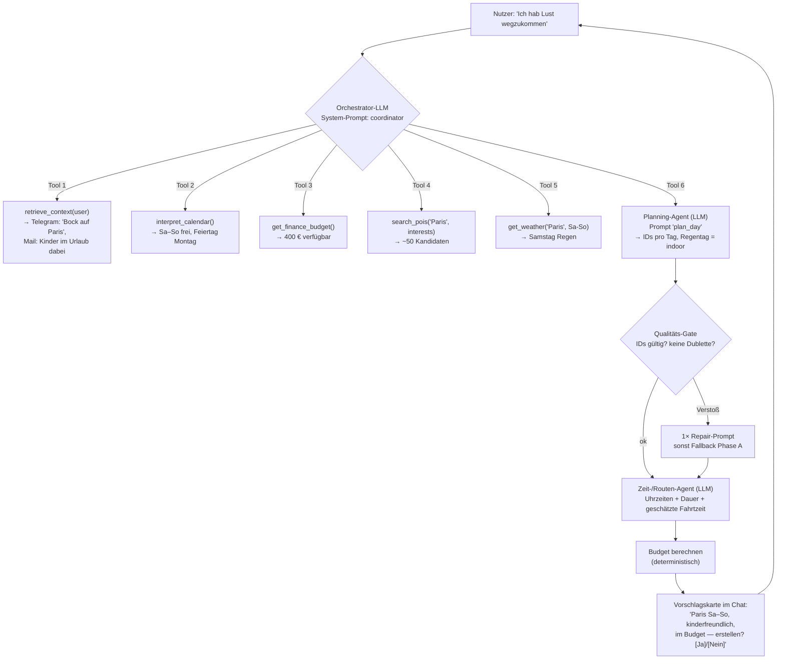

# Umbau-Vorschlag — vom regelbasierten zum agentengetriebenen Reise-System

> Erstellt nach Tiefenanalyse des **gesamten Codes** (Stand 2026-06-27) und auf Basis der Review-Session
> mit dem Professor. **Dieses Dokument enthält nur Analyse + Vorschlag — kein Code.**
> Abgeglichen mit den aktuellen Design-Dokumenten dieser Session: ARCHITEKTUR_PLANUNG_LLM.md,
> IMPLEMENTIERUNGSPLAN_PHASE_B.md, ZUKUNFT_NOTIZEN.md. (Die früheren Dokumente ZIELARCHITEKTUR.md /
> SYSTEM_ARCHITECTURE.md sind als „Old Documentation – do not use" deprecatet und werden bewusst nicht herangezogen.)
>
> **Team-Entscheidungen vom 2026-06-27 sind in Abschnitt 10 festgehalten und in die Abschnitte 2, 3, 5, 8 eingearbeitet.**

---

## 1. Ist-Analyse (kompakt)

### 1.1 Zwei Einstiegspunkte, inkonsistent verdrahtet
- **Streamlit** ([streamlit_app.py](reiseagent/streamlit_app.py)) ruft den Coordinator **direkt per Import**
  über [ui_service.py](reiseagent/ui_service.py) auf (`coordinator.handle_plan_request`,
  `coordinator.handle_chat_message`).
- **FastAPI** ([main.py](reiseagent/main.py)) bietet dieselbe Logik als HTTP-API + 3 Hintergrund-Threads
  (Monitoring, Navigations-Erinnerung, Telegram-Callbacks).
- Streamlit nutzt die API **nicht** — es gibt zwei parallele Pfade.

### 1.2 Die Orchestrierung ist ein fest verdrahteter Workflow
`coordinator.handle_plan_request()` ([coordinator.py:27](reiseagent/agents/coordinator.py)) ist eine
**lineare, hartcodierte Sequenz**:
```
Profil-Interessen mergen → Wetter → Places → planning.create_plan
   → (if flight_number) Flug anpassen → Budget → Checklist
```
Kein Agent entscheidet etwas. Es gibt keinen Router. Die Reihenfolge ist in Python festgeschrieben.

### 1.3 Der Chat ist ~1300 Zeilen Regex — nicht KI
`coordinator.handle_chat_message()` ([coordinator.py:262](reiseagent/agents/coordinator.py)) klassifiziert
Nutzereingaben über **hunderte Keyword-/Regex-Regeln** (`_is_clear_time_change_request`,
`_is_clear_replan_request`, `_category_from_text`, `_extract_requested_time` …) und ruft dann
deterministische Handler. Das LLM (`_groq_response`, [coordinator.py:1575](reiseagent/agents/coordinator.py))
ist nur ein **Fallback**, der frei antwortet, aber **den Plan nicht ändern kann**.
→ Genau der Punkt des Professors: „kein Unterschied zu ChatGPT", weil hier das LLM nur plaudert und die
Regeln die Arbeit machen.

### 1.4 LLM wird nur punktuell genutzt — ohne Tool-Calling, ohne zentrale Stelle
Vier Stellen rufen Groq (`llama-3.3-70b-versatile`) direkt und inline auf, jeweils mit Einzel-Prompt:
| Datei | Zweck | Tool-Calling? |
|---|---|---|
| [daily_brief.py:62](reiseagent/agents/daily_brief.py) | Morgenbrief-Text | nein |
| [navigation.py:28](reiseagent/agents/navigation.py) | Erinnerungstext | nein |
| [suggestion_agent.py:121](reiseagent/agents/suggestion_agent.py) | Vorschlag als JSON | nein |
| [coordinator.py:1587](reiseagent/agents/coordinator.py) | Chat-Q&A-Fallback | nein |

Kein zentrales `llm.py`, kein Tool-Calling, keine Prompt-Templates an einer Stelle.

### 1.5 Wo Qualitätsfehler entstehen (z.B. „Notre-Dame doppelt")
- **Dedup ist nur exakter Namensabgleich pro Aufruf:** `_rank_and_deduplicate`
  ([places.py:594](reiseagent/providers/places.py)) dedupliziert per *exakt normalisiertem Namen*.
  „Notre-Dame Cathedral" (CITY_HIGHLIGHTS) und „Cathédrale Notre-Dame" (OpenTripMap) gelten als
  **verschieden** → beide landen im Pool → Dublette möglich.
- **Keine globale Plan-Validierung:** `planning.create_plan` verhindert via `used_ids` nur **gleiche IDs**.
  Zwei verschiedene IDs für denselben realen Ort werden nicht erkannt.
- **Chat fügt ungeprüft hinzu:** `_custom_activity` ([coordinator.py:966](reiseagent/agents/coordinator.py))
  erzeugt neue UUIDs; die einzige Schranke ist ein exakter Namensvergleich (`_plan_contains_activity`).
- **Fazit:** Es fehlt eine **semantische, quellenübergreifende Dedup** + eine **finale Qualitätsprüfung**
  des fertigen Plans. Das ist die strukturelle Ursache des vom Professor gesehenen Fehlers.

### 1.6 Kontext-Integration (Telegram/Mail/Kalender) — heute oberflächlich
- **Telegram** ([telegram.py:99](reiseagent/providers/telegram.py)): `get_recent_messages` holt die letzten
  100 Updates, filtert nach Zeit; `find_trip_relevant_messages` filtert nach **hartcodierten Keywords**.
  **Keine Speicherung. Keine Vektordatenbank. Kein Retrieval.**
- **Gmail** ([gmail.py:54](reiseagent/providers/gmail.py)): gleiches Muster — Keyword-Filter, keine Speicherung.
- **Profil-Lernen** ([profile_learner.py](reiseagent/agents/profile_learner.py)): extrahiert Interessen per
  **Regex/Keyword** in `profile.db` (`interests`-Tabelle). Roh-Nachrichten werden **nicht** abgelegt.
- **Kalender** ([calendar.py:80](reiseagent/providers/calendar.py)): `find_free_days` betrachtet einen Tag nur
  dann als belegt, wenn er einen **REISEAGENT-Marker** trägt (`blocks_reiseagent_day`). **Echte fremde
  Kalendertermine blockieren keinen Tag** → die Freizeit-Erkennung ist praktisch wirkungslos für reale Termine.
- **Antwort auf die Frage des Professors** („Vektor-DB? ein Dokument pro Nachricht? wie gematcht?"):
  Heute = **nichts davon**. Es ist Keyword-Filter + Regex-Extraktion. Das ist eine klare Lücke (Abschnitt 4).

### 1.7 Proaktivität existiert, ist aber nicht verbunden
Die Bausteine sind da, aber nicht zu einem proaktiven Erlebnis verdrahtet:
- `free_time_detector` → `suggestion_agent` → `profile.db` → API `/api/suggestions/*` — **nur manuell per
  Endpoint** auslösbar, **kein Scheduler**, **nicht im Chat sichtbar**.
- `monitoring._monitoring_loop` ([main.py:50](reiseagent/main.py)) läuft im Hintergrund — aber **nur für
  Wetter + Flüge**, nicht für proaktive Reisevorschläge.

### 1.8 Flug-Logik ist rein regelbasiert
Flug-API wird nur getriggert, wenn `request["flight_number"]` gesetzt ist
([coordinator.py:75](reiseagent/agents/coordinator.py), [monitoring.py:226](reiseagent/agents/monitoring.py)).
Der Agent **entscheidet nicht selbst**, dass ein API-Call sinnvoll wäre.

### 1.9 Was heute deterministisch ist
Zeiten/Taktung ([planning.py](reiseagent/agents/planning.py)), Fahrtzeiten
([providers/navigation.py](reiseagent/providers/navigation.py)), Budget ([budget.py](reiseagent/agents/budget.py)),
Kalender-Freitage-Mathematik. Diese rechnen heute korrekt und deterministisch.
> **Team-Entscheidung (2026-06-27):** Für **Zeiten + Fahrtzeiten** wird bewusst ein **LLM-Experiment** gemacht
> (siehe Abschnitt 3 „Zeit-/Routen-Agent" und Abschnitt 5). **Budget** und **Kalender-/Dedup-Mathematik**
> bleiben deterministisch.

### 1.10 Persistenz & bereits vorhandene Bausteine (Status quo)
- [store.py](reiseagent/store.py) ist **SQLite** (`trips`-Tabelle, ein JSON-Blob pro Trip) — bereits persistent.
- [profile_store.py](reiseagent/profile_store.py) ist SQLite (`interests`, `past_events`, `free_days`,
  `suggestions`).
- [providers/flights.py](reiseagent/providers/flights.py) und [monitoring.py](reiseagent/agents/monitoring.py)
  **existieren bereits** (Wetter-/Flug-Überwachung im Hintergrund-Thread).
- [models.py](reiseagent/models.py) enthält `TypedDict`s — werden aber **nicht zur Validierung** genutzt, nur
  als Typ-Hinweise. (Relevant für die Qualitäts-Gates in Abschnitt 3.)

---

## 2. Ziel-Architektur

### 2.1 Leitidee
Ein **LLM-Orchestrator** (Supervisor) nimmt die Nutzereingabe + einen verdichteten Kontext entgegen und
**entscheidet selbst per Tool-Calling**, welche Fähigkeiten (= Agenten/Provider als Tools) in welcher
Reihenfolge aufgerufen werden. Jeder Agent hat einen **eigenen System-Prompt**, **klare Tools** und ein
**Qualitäts-Gate** für seinen Output.

### 2.2 Orchestrierungs-Ansatz — Entscheidung: LangGraph
Zwei Optionen wurden abgewogen:

| Option | Pro | Contra |
|---|---|---|
| A) LLM-Tool-Calling-Loop in Plain-Python | Sehr einfach, kein Framework. | State-Handling selbst pflegen. |
| **B) LangGraph** ✅ **gewählt** | Expliziter State-Graph, sauberes Tracing/Verzweigungen, „sieht in der Präsentation mehr nach Architektur aus". | Zusätzliche Abhängigkeit + neue Konzepte zum Einarbeiten. |

**Entscheidung (2026-06-27): LangGraph.** Der Workflow wird als expliziter Graph mit gemeinsamem `TripState`
modelliert (Knoten = Agenten, Kanten = Übergänge, teils bedingt). Das passt gut zur Forderung „Beobachtbarkeit/
Flowchart", weil der Graph selbst schon eine nachvollziehbare Struktur liefert. **Wichtig fürs Team:** Damit es
nicht zu komplex wird, halten wir die Knoten einfach (jeder Knoten ruft genau einen Agenten/ein Tool auf) und
führen LangGraph schrittweise ein (erst der Chat-Pfad, dann der Rest).

### 2.3 Routing-Mechanismus (Agent entscheidet, nicht fester Workflow)
```
Nutzereingabe ──► ORCHESTRATOR (LLM, LangGraph-Einstieg)
                    │  System-Prompt: "Du bist der Reise-Koordinator. Nutze die
                    │  Tools, um die Anfrage zu erfüllen. Entscheide selbst, welche
                    │  und in welcher Reihenfolge."
                    │
                    ├─ Tool ──► retrieve_context(user_id, query)       [Memory/RAG]
                    ├─ Tool ──► interpret_calendar()                   [LLM: frei/belegt, Feiertage]
                    ├─ Tool ──► search_pois(city, interests)           [Provider]
                    ├─ Tool ──► get_weather(city, dates)               [Provider]
                    ├─ Tool ──► build_day_plan(candidates, ...)        [Planning-Agent, LLM]
                    ├─ Tool ──► schedule_times_and_routes(plan)        [Zeit-/Routen-Agent, LLM]
                    ├─ Tool ──► check_flight(...) / search_flight(...)
                    ├─ Tool ──► calculate_budget(plan)                 [determ.]
                    └─ liefert Antwort + strukturierten Plan + Trace
```
Das LLM bekommt die **Tool-Liste** und ruft selbstständig auf — die Reihenfolge ist **nicht** mehr in
`coordinator.py` festverdrahtet. Der bisherige lineare Ablauf wird zum **Default-Hinweis im Prompt**, nicht
zur Code-Verzweigung.

### 2.4 Abgleich mit den aktuellen Session-Dokumenten
- **ARCHITEKTUR_PLANUNG_LLM.md** definiert die Arbeitsteilung „LLM kuratiert Orte". → übernommen; der
  **Planning-Agent** (Abschnitt 3) ist genau dieser Kurator. *Abweichung 2026-06-27:* die Zeit-/Routen-Rechnung
  wandert ebenfalls ins LLM (Experiment), das Budget bleibt deterministisch.
- **IMPLEMENTIERUNGSPLAN_PHASE_B.md** ist die fertige Spezifikation für `places.py`-Fix + `llm.py`
  (`curate_plan`). → wird **Phase 2 des Migrationsplans** (Abschnitt 8), ergänzt um die **Qualitäts-Gates**.
- **ZUKUNFT_NOTIZEN.md** hält die spätere Vision fest (Kalender-Trigger, Profil-Fragebogen, Finanzmodell,
  Tagesausflüge). → fließt in **Proaktiv-UX** (Abschnitt 6) und die späteren Migrationsphasen ein.

---

## 3. Agenten-Katalog (Verantwortung · Tools · System-Prompt · Qualitäts-Gate)

> System-Prompts werden als **Templates mit Variablen** zentral in `prompts.py` geführt (für die Präsentation
> sichtbar). Alle LLM-Prompts **auf Englisch**, Ortsnamen **original**.

| Agent | Verantwortung | Tools | System-Prompt (Skizze) | Qualitäts-Gate |
|---|---|---|---|---|
| **Orchestrator** *(neu)* | Versteht Anfrage, entscheidet Tool-Aufrufe & Routing | alle Agenten/Provider als Tools | „You are the travel coordinator. Use tools to fulfil `{user_message}`. Decide which tools and order. Don't calculate yourself." | bildet auf erlaubtes Tool/Intent ab; max. N Schritte; bei Schleife → Rückfrage |
| **Planning-Agent** *(= `llm.curate_plan`; ersetzt planning+recommendation als Kurator)* | Wählt & ordnet aus ~50 Kandidaten die Aktivitäten pro Tag (ein Aufruf/Trip) | `search_pois`, `get_weather` | „From candidates pick genuinely worth-visiting places for a `{days}`-day trip to `{city}`, interests `{interests}`, weather `{weather}`. ~4–5/day. Day rhythm: morning→lunch→afternoon→dinner. Return only IDs per day." | JSON-valide; IDs ∈ Kandidaten; **keine Dublette im ganzen Plan**; ≥N/Tag; sonst 1× Repair, dann Fallback `pick_activities_for_day` |
| **Zeit-/Routen-Agent** *(NEU, LLM — Experiment 2026-06-27)* | Bekommt vom Planning-Agent die geordnete Aktivitätsliste **mit Koordinaten** und legt **Startzeiten + sinnvolle Dauer** fest; **schätzt die Fahrtzeit** zwischen aufeinanderfolgenden Orten anhand der Standorte und plant sie ein | Koordinaten der Activities; optional `get_route` (OpenRouteService) zur Validierung | „Given an ordered list of activities with coordinates for one day, assign realistic start/end times. Set a sensible duration per activity by type. Estimate travel time between consecutive places from their coordinates and leave that gap. Anchor meals to lunch/dinner. Keep within `{day_start}`–23:59. Return JSON: per activity start, end, est_travel_to_next_min." | keine Überschneidungen; Endzeit > Startzeit; Fahrtzeit-Lücke vorhanden; plausible Dauern; ≤ 23:59; **kein deterministischer Fallback** (Team-Entscheidung) — bei ungültiger Ausgabe 1× Repair-Prompt, danach wird die LLM-Ausgabe übernommen |
| **POI/Places-Tool** | Liefert saubere Kandidaten | OpenTripMap, Geocoding | (kein LLM) | **semantische, quellenübergreifende Dedup**; Müll-Vorfilter `_is_bad_place`; bei API-Ausfall leere Liste + Status |
| **Budget-Agent** *(behalten, deterministisch)* | Kosten berechnen & prüfen | — | (kein LLM) | Summen konsistent; Status korrekt |
| **Checklist-Agent** *(→ LLM)* | Personalisierte Packliste | — | „Create a packing/prep list for `{trip}`, weather `{weather}`, travel type `{type}`." | Schema-valide Items; dedupliziert; nicht leer |
| **Replanning-Agent** *(→ LLM-Auswahl, **Human-in-the-Loop via Telegram**)* | Ersatz bei Wetter/Flug-Event; erstellt einen **Vorschlag**, der erst nach Nutzer-Bestätigung aktiv wird | `search_pois`, Telegram (`send_..._proposal`) | „Replace the affected outdoor activities with indoor alternatives fitting `{interests}`, not already in the plan." | Ersatz ist indoor bei Schlechtwetter; nicht schon im Plan; Budget neu berechnet; **Telegram-Nachricht** mit Annehmen/Ablehnen-Buttons wird gesendet, die (1) *dass* es eine Änderung gibt, (2) *warum*, (3) *was genau* sich ändert, beschreibt; Plan wird **erst bei „Annehmen"** übernommen |
| **Memory-/Kontext-Agent** *(neu)* | Speichert & findet relevante Telegram/Mail-Infos | `store_message`, `retrieve_context` | „Extract preferences/constraints (family, dislikes, wishes) from `{messages}` relevant to `{query}`." | nur belegte Fakten; Quelle + Datum mitführen |
| **Profil-Lerner** *(behalten + LLM)* | Vorlieben aus Nachrichten & Feedback | — | „From `{message}` infer interest categories and sentiment." | Kategorie ∈ `culture/food/nature/sightseeing/shopping`; Score plausibel |
| **Kalender-/Freizeit-Agent** *(→ LLM-Interpretation, Entscheidung 2026-06-27)* | Liest Kalendertermine und lässt das **LLM interpretieren**, welche Tage wirklich frei sind | Google Calendar | „Given calendar events for the coming weeks, decide for each day if it is free for a trip. Treat public holidays (Christmas, Easter, New Year …) as free. Interpret entries: 'work 8–16' = partly busy, only 'gym'/'doctor' = mostly free, 'vacation' = free window. Detect weekends and long weekends/bridge days. Return free/partly/busy + reason per day." | Feiertage als frei gewertet; plausible Einstufung pro Tag; Begründung mitgeführt |
| **Vorschlags-Agent** *(behalten + budgetbewusst)* | Proaktive Tagesvorschläge | `search_pois`, Budget | „Given free days, profile, budget, propose a trip/day." | JSON-valide; Aktivitäten ∈ POIs; im Budget |
| **Monitoring-Agent** *(behalten)* | Wetter/Flug-Überwachung | Wetter-, Flug-API | (Regeln + LLM-Bewertung) | Schwellen sauber; keine Doppel-Proposals |
| **Tagesbrief-Agent** *(EINGEFROREN)* | Morgenbrief-Text | — | bestehend | **Nicht weiterentwickeln.** Status (funktioniert?) ist unklar; bleibt unangetastet bis zu einer bewussten Entscheidung |
| **Navigations-Agent** *(behalten)* | Erinnerungstext | — | bestehend | Länge/Format ok |

**Einheitliches Qualitäts-Muster für alle LLM-Agenten:** `parse → validate (Schema + Regeln) → bei Fehler
1× Repair-Prompt → sonst deterministischer Fallback`. Optional für subjektive Qualität ein **LLM-as-Judge**
(„Is this a sensible, non-repetitive day plan? yes/no + reason"). Das ist die direkte Antwort auf die
Forderung „Qualitätssicherung pro Agent" und behebt strukturell den „Notre-Dame doppelt"-Fehler.

### 3.1 Wann läuft welcher Agent? (synchron vs. geplant)
Wichtige Unterscheidung, damit nichts „jede Minute" läuft:

- **Synchron / on-demand** (laufen genau dann, wenn der Nutzer plant oder ändert — **nicht** zeitgesteuert):
  Orchestrator, Planning-Agent, **Zeit-/Routen-Agent**, POI-Tool, Budget, Checklist, Replanning,
  Memory-Retrieval. → Der **Zeit-/Routen-Agent ist also kein wöchentlicher Job**; er läuft direkt nach dem
  Planning-Agent, immer wenn ein Plan gebaut/geändert wird.
- **Geplant / im Hintergrund** (Scheduler): **Kalender-/Freizeit-Agent** + Vorschlags-Agent →
  **einmal pro Woche, z.B. samstags** (damit nicht ständig der Kalender abgefragt wird). Der bestehende
  **Monitoring-Agent** (Wetter/Flüge) behält sein eigenes Intervall.

---

## 4. Kontext-/Memory-Schicht (Telegram / Mail / Kalender)

### 4.1 Problem heute
Nachrichten werden geholt, keyword-gefiltert und weggeworfen. Es gibt kein Gedächtnis und kein Matching
einer Anfrage gegen frühere Inhalte (siehe 1.6).

### 4.2 Vorschlag — Entscheidung: RAG mit Vektor-DB
**Stufe 1 (Basis):**
- Neue Tabelle in `profile.db`: `messages(id, source, date, text, extracted_json)` — **ein Dokument pro
  Nachricht** (beantwortet die Frage des Professors konkret).
- Persistente Speicherung statt Wegwerfen.

**Stufe 2 (gewählt ✅): echtes RAG mit Vektor-DB.**
- Pro Nachricht ein **Embedding** in einem leichten Vektor-Store (z.B. Chroma/FAISS) bzw. Tabelle
  `message_embeddings`; Matching einer Nutzeranfrage per **Cosine-Similarity (Top-k)**.
- `retrieve_context(query)` gibt die semantisch passendsten Nachrichten zurück → werden als „Kontext"-Block in
  den Planning-/Vorschlags-Prompt injiziert.
- **Begründung:** Beantwortet die RAG-Frage des Professors nicht nur konzeptionell, sondern als echtes Feature
  (Lehrwert + Differenzierung von ChatGPT). Stufe 1 ist die Datengrundlage, Stufe 2 die Suche darüber.

### 4.3 Wie der Kontext einfließt
```
store_message (bei jedem Telegram/Mail-Poll)  ──► profile.db.messages (+ Embedding)
retrieve_context(query)  ──► Top-k Nachrichten (semantisch) ──► als "User context" in den
                                                                 System-Prompt von Planning/Vorschlag
profile_learner (LLM)    ──► interests/past_events  ──► dito als Profil-Block
```
Damit ist im Flowchart sichtbar: „Was nimmt er aus Telegram?" → konkrete Nachrichten-Snippets, die im Prompt
landen.

---

## 5. Rechen-Schnittstelle: wo Regel, wo LLM, wo LLM-generierter Code

| Aufgabe | Ansatz | Begründung |
|---|---|---|
| **Budget**, Kalender-Mathematik, **Dedup** | **Deterministische Tools** (behalten) | Exakt, testbar; Budget muss stimmen |
| POI-Auswahl, Reihenfolge, Tagesrhythmus, Checklist, Replanning-Auswahl, Chat-Intent, Routing, **Kalender-Interpretation** | **LLM** | Braucht Geschmack/Weltwissen/Sprache |
| **Uhrzeiten + Dauer + geschätzte Fahrtzeiten** | **LLM (Experiment 2026-06-27)** | Bewusste Team-Entscheidung: wir geben dem LLM die Standorte und lassen es Zeiten/Dauer/Fahrtzeit *schätzen*. Das ist eher eine *Einschätzung* als exakte Mathematik. **Kein Fallback** (Team-Entscheidung): wir committen auf die LLM-Variante; bei ungültiger Ausgabe nur 1× Repair-Prompt |
| Genuin variable Berechnungen — also **echte Fall-zu-Fall-Rechnungen, die man nicht fest hinschreiben kann** (heute keine) | **LLM-generiertes Code-Snippet** | Vom Professor genannt; **optionale Erweiterung in der Zukunft** (z.B. Finanz-Sparszenarien), aktuell nicht gebaut |

**Hinweis zur Abgrenzung:** Der Professor sagte „LLMs rechnen schlecht". Deshalb teilen wir bewusst auf:
**exakte** Rechnungen (Budget) bleiben deterministisch; **schätzende** Aufgaben (ungefähre Fahrtzeit, sinnvolle
Dauer, Zeitplan) probieren wir mit dem LLM aus — bewusst **ohne** deterministischen Fallback (nur ein
Repair-Prompt als Sicherung), um die LLM-Variante ehrlich zu testen. Genau diese Grenze sauber
herauszuarbeiten war ein Wunsch des Professors.

---

## 6. Interaktions-/UX-Umbau

### 6.1 Zwei kombinierte Modi (Formular bleibt — ausdrücklicher Wunsch des Professors)
- **Formular „eigene Reise planen"** ([streamlit_app.py:1538](reiseagent/streamlit_app.py)) **bleibt** für
  „schnell mal abchecken".
- **Chat-/Agenten-Modus** wird zum primären, agentischen Weg: Freitext → Orchestrator (LangGraph) →
  kann **planen, ändern, vorschlagen, Fragen beantworten**. Ersetzt die Regex-Maschine aus 1.3.

### 6.2 Proaktiv + iterativ (wie ein Reisebüro)
- **Proaktiver Vorschlag:** Scheduler löst `Kalender-/Freizeit-Agent` + `suggestion_agent` aus; das Ergebnis
  erscheint als **Karte im Chat**: „Du hattest am Wochenende Lust auf Paris — soll ich planen? [Ja] [Nein]".
  Ein Klick = Plan wird erstellt (Human-in-the-Loop). Entspricht dem „Kalender-Trigger für Auto-Trips" aus
  ZUKUNFT_NOTIZEN.md §1.
- **Iterative Verfeinerung:** „Das Restaurant kenne ich schon, gib mir ein anderes" → Replanning-Agent
  ersetzt gezielt einen Slot (LLM-Auswahl), Plan & Kalender werden aktualisiert.
- **Profil-Trennung (jetzt umsetzen, Entscheidung 2026-06-27):** Bei **manuellen** Reisen werden Profil-Interessen
  **nicht** automatisch übernommen — das automatische Mergen (heute `coordinator.py:37–47`) greift künftig nur
  bei **Auto-Vorschlägen** (ZUKUNFT_NOTIZEN.md §2).

### 6.3 Flug als Agenten-Entscheidung
Statt „wenn Feld Flugnummer gesetzt": Das LLM **entscheidet**, ob `check_flight`/`search_flight` nötig ist
(z.B. Nutzer nennt nur Starthafen → Agent sucht Flug, zieht Datum/Ankunft). Tool vorhanden
([providers/flights.py](reiseagent/providers/flights.py)), nur der **Auslöser** wandert vom `if` ins LLM.

---

## 7. Beobachtbarkeit / Flowchart „unter der Motorhaube"

### 7.1 Bausteine
- **`prompts.py` (neu):** alle System-Prompts als **Templates mit benannten Variablen** an einer Stelle →
  in der Präsentation direkt zeigbar („simpler Prompt vs. Template").
- **`llm.py` (neu, zentral):** jeder LLM-Aufruf läuft hier durch und **loggt**: Agentname, Prompt-Template-ID,
  gefüllte Variablen, angebotene Tools, gewähltes Tool, Roh-Antwort.
- **Trace-Objekt:** pro Anfrage eine Schritt-Liste `[{agent, tool, input, output, prompt_id, decision}]`,
  die im Ergebnis (und in `agent_insights`) mitläuft. (Mit LangGraph fällt der Ablauf ohnehin als Graph an.)
- **UI:** ein Expander „Was die Agenten gemacht haben" zeigt den Trace; daraus lässt sich für die Folien ein
  **Mermaid-Flowchart** generieren.
- **Live-Trace im Terminal (für die Demo):** Beim Ausführen schreibt das System den Ablauf **Schritt für
  Schritt in die Konsole**, z.B.:
  ```
  [Orchestrator] entscheidet → retrieve_context
  [Memory]       3 relevante Nachrichten gefunden
  [Kalender]     Sa–So frei (Montag Feiertag)
  [Planning]     5 Orte gewählt
  [Zeit/Routen]  Uhrzeiten + Fahrtzeiten gesetzt ✓
  [Budget]       im Budget (320 € / 400 €)
  → Vorschlag erstellt, warte auf Bestätigung
  ```
  So sieht der Professor **live**, wie das System „denkt" und welche Agenten/Tools nacheinander greifen —
  ergänzend zum Mermaid-Flowchart auf den Folien. Technisch einfach: das zentrale `llm.py`-Logging (und die
  LangGraph-Knoten) geben pro Schritt eine `print`-Zeile aus.

### 7.2 Durchgespieltes Beispiel (für die Präsentation)
**Nutzerprompt:** *„Ich hab Lust, mal wegzukommen."*

Hinter jedem Knoten steht ein **benanntes Prompt-Template** aus `prompts.py` — genau das, was der Professor
sehen wollte. **Das kann ChatGPT nicht:** Kalender-Freizeit, gelernte Vorlieben aus Telegram/Mail, Budget,
Live-Wetter — alles in einem orchestrierten Ablauf mit Bestätigungs-Loop.

---

## 8. Migrationsplan (phasiert, mit Abhängigkeiten & Risiken)

> **Scope-Entscheidung (2026-06-27):** Wir wollen letztlich **alle Phasen** umsetzen, konzentrieren uns aber
> **aktuell auf Phase 0 + 1**. Weitere Phasen folgen, wenn Zeit da ist.
> „Nicht brechen" = öffentliche Signaturen & Activity-Dict-Shape aus Abschnitt 9.

| Phase | Inhalt | Fokus jetzt? | Abhängigkeiten / Risiko |
|---|---|---|---|
| **0 — Fundament** | `llm.py` zentral + `prompts.py` (Templates) + Trace-Logging. Bestehende Groq-Aufrufe darauf umstellen. | **Ja** | niedrig; rein additiv |
| **1 — Orchestrator (Chat) mit LangGraph** | Regex-Chat (1.3) durch **LangGraph-Graph** ersetzen; bestehende Handler als **Tools/Knoten** kapseln (planen/ändern/löschen/vorschlagen). | **Ja** | hoch: viel hängt an `handle_chat_message`; **A3 Telegram nicht anfassen**; Handler als Tools wiederverwenden |
| **2 — Places-Fix + Planning-Agent + Zeit-/Routen-Agent + Qualitäts-Gates** | IMPLEMENTIERUNGSPLAN_PHASE_B.md umsetzen (`places.py`-Fix + `llm.curate_plan`), **neuer Zeit-/Routen-Agent (LLM)**, semantische Dedup + finale Plan-Validierung → behebt „Notre-Dame doppelt". | wenn Zeit | mittel: `create_plan`/`get_places`-Signaturen halten; Fallback behalten |
| **3 — Memory/RAG** | `messages`-Tabelle + Embeddings + `retrieve_context` (Vektor-DB); Kontext in Planning/Vorschlag injizieren. | wenn Zeit | mittel |
| **4 — Proaktiv + Scheduler** | Scheduler (z.B. **wöchentlich, Samstag**) → Kalender-/Freizeit-Agent (LLM-Interpretation) → Vorschlagskarte im Chat. | wenn Zeit | mittel; Workflow/Frequenz noch offen (siehe Frage 6) |
| **5 — Flug-als-Entscheidung, Finanz, Feedback** | Flug-Tool ins LLM; Finanzmodell; Feedback-Schleife; Tagesausflüge. | später | höher |

**Reihenfolge-Begründung:** Phase 0+1 bringen den größten sichtbaren „agentischen" Sprung und die vom
Professor verlangten Artefakte (Prompt-Templates, Flowchart, Tool-Routing) bei überschaubarem Risiko.

---

## 9. Abhängigkeiten, die NICHT unbemerkt brechen dürfen

| Signatur / Vertrag | Aufrufer (Auszug) | Beim Umbau beachten |
|---|---|---|
| `get_places(destination, interests) -> list[activity]` | coordinator:61/507, streamlit:388/566/960, main:255, monitoring:113, suggestion_agent:76, test_all:77 | Signatur & Rückgabe-Shape halten |
| `create_plan(request, all_activities, weather) -> days` | coordinator:72, test_all:144 | LLM-Aufrufe (Kurator + Zeit/Routen) **innen** kapseln, Signatur halten |
| `handle_plan_request(request, use_mock_weather)` | ui_service:15/44, main:191 | Rückgabe-Dict-Form halten |
| `handle_chat_message(trip, message) -> {message, agent_insights, …}` | ui_service:75, main:225 | Rückgabe-Form halten; intern auf LangGraph/Tool-Calling umstellen |
| `pick_activities_for_day(...)` | planning:82, test_all:130 | Als **Fallback** erhalten |
| `score_activity(...)` | recommendation:116, replanning:56/71, test_all:120 | `quality_score` muss Zahl bleiben |
| **Activity-Dict-Shape** (`id,name,category,location{lat,lng},estimated_cost_per_person,estimated_cost_total,duration_minutes,indoor_outdoor,tags,source,…`) | budget, planning, recommendation, replanning, streamlit, calendar | Felder vollständig erhalten |
| `store.*`, FastAPI-Endpunkte, Telegram-Callbacks (A3) | main.py, ui_service | unverändert lassen |

---

## 10. Entscheidungen & verbleibende offene Punkte (Stand 2026-06-27)

1. **Memory-Tiefe:** ✅ **RAG mit Vektor-DB** bauen (Abschnitt 4.2, Stufe 2).
2. **LLM-generierter Code:** ✅ **Optionale Erweiterung in der Zukunft** — jetzt nicht bauen, nur als
   verstandene Option dokumentieren (Abschnitt 5).
3. **Orchestrierung:** ✅ **LangGraph** (Abschnitt 2.2).
4. **Scope nächste Woche:** ✅ **Alles wird angestrebt**, Fokus liegt aber **jetzt auf Phase 0 + 1**; weitere
   Phasen, wenn Zeit da ist (Abschnitt 8).
5. **Streamlit vs. FastAPI:** ✅ **Option B (parallel lassen) für jetzt** — neuer Orchestrator in einem
   gemeinsamen Modul; saubere Vereinheitlichung später.
6. **Kalender-Interpretation:** ✅ **LLM interpretiert den Kalender** (Abschnitt 3 „Kalender-/Freizeit-Agent"):
   - Feiertage (Weihnachten, Ostern, Neujahr …) → Tag als **frei** werten.
   - Termine interpretieren: „Arbeit 8–16" → teilbelegt; nur „Gym"/„Arzt" → weitgehend frei; „Urlaub" →
     Urlaubsfenster; Wochenenden/verlängerte Wochenenden/Brückentage erkennen.
   - **Verbleibend offen (bewusst noch zu klären, soll einfach bleiben):** *Wie oft* läuft das? Vorschlag:
     **einmal pro Woche (z.B. samstags)**, weil der Nutzer dann eher Zeit hat. Außerdem offen: wie genau der
     Workflow gegliedert wird (Kalender lesen → LLM interpretieren → an Vorschlags-/Planning-Agent weitergeben),
     ohne zu komplex zu werden. → Im Team final festlegen.
7. **Profil bei manuellen Reisen:** ✅ **Jetzt umsetzen** — Trennung manuell/Auto-Trip (Abschnitt 6.2,
   ZUKUNFT_NOTIZEN.md §2).

---

## 11. Nächster Schritt
Nach diesen Entscheidungen kann **Phase 0** (zentrales `llm.py` + `prompts.py` + Trace) als erster,
risikoarmer Implementierungsschritt gestartet werden — er liefert sofort die Prompt-Template- und
Flowchart-Artefakte für die Präsentation, ohne bestehendes Verhalten zu ändern.
**Ich implementiere erst nach deiner Freigabe.**
